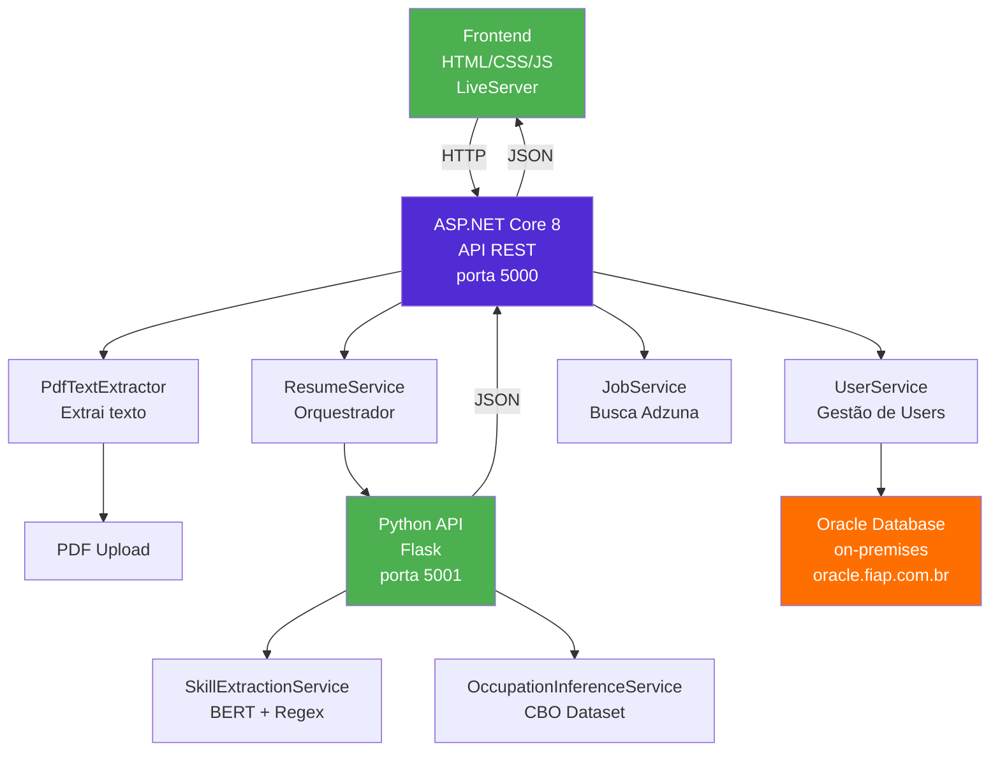
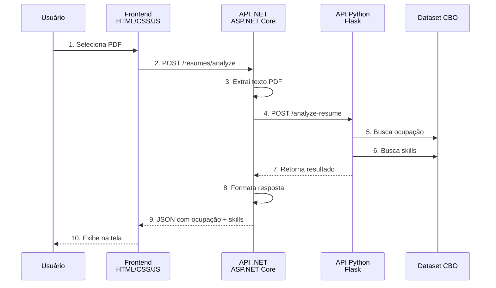

# 💼 Sistema de Gestão de Currículos - .NET API

> **Projeto:** Global Solution FIAP 2025  
> **Instituição:** FIAP - Faculdade de Informática e Administração Paulista  
> **Curso:** Análise e Desenvolvimento de Sistemas

---

## 👥 Equipe Responsável

| RM | Nome |
|---|---|
| RM556152 | Daniel da Silva Barros |
| RM558253 | Luccas de Alencar Rufino |
| RM5550063 | Raul Clauson |

---

## 📋 Descrição do Projeto

Sistema backend em **.NET 8** que gerencia currículos de candidatos, integrando-se com uma **API Python de IA** para análise inteligente de ocupações e extração de skills.

### Funcionalidades Principais

- 📄 **Upload de PDF**: Recebe currículos em PDF
- 🔗 **Integração IA**: Chama API Python para análise
- 💼 **Extração de Ocupação**: Identifica a profissão do candidato
- 🎯 **Extração de Skills**: Detecta habilidades técnicas
- 📊 **Matching de Vagas**: Calcula compatibilidade candidato-vaga
- 👤 **Gestão de Usuários**: CRUD completo com banco Oracle
- 🔍 **Busca de Vagas**: Integração com API Adzuna

---

## 🏗️ Arquitetura do Sistema



---

## 🚀 Começando

### 1️⃣ **Pré-requisitos**

Instale:
- **.NET 8 SDK** ou superior
- **Visual Studio 2022** ou **Visual Studio Code**
- **Git**
- Acesso ao **Oracle Database** (oracle.fiap.com.br)

### 2️⃣ **Clonar Repositório**

```bash
cd c:/Users/seu_usuario/Desktop/entregas-gs
git clone <url_repositorio>
cd dotnet-gs2-2025
```

### 3️⃣ **Configurar Variáveis de Ambiente (.env)**

Crie arquivo `.env` na raiz do projeto com as credenciais:

```bash
# ============================================
# ADZUNA API
# ============================================
ADZUNA_APP_ID=
ADZUNA_APP_KEY=

# ============================================
# HUGGING FACE
# ============================================
HUGGINGFACE__TOKEN=

# ============================================
# ORACLE DATABASE (On-Premises)
# ============================================
ORACLE_USER_ID=
ORACLE_PASSWORD=
ORACLE_DATA_SOURCE=(DESCRIPTION=(ADDRESS=(PROTOCOL=TCP)(HOST=oracle.fiap.com.br)(PORT=1521))(CONNECT_DATA=(SERVICE_NAME=orcl)))
```

### 4️⃣ **Restaurar Dependências e Compilar**

```bash
dotnet restore
dotnet build
```

### 5️⃣ **Executar a API**

```bash
dotnet run
```

**Esperado:**
```
info: Microsoft.Hosting.Lifetime[14]
      Now listening on: http://localhost:5000
```

A API estará disponível em **http://localhost:5000**

---

## 📡 Endpoints da API

### Base URL: `http://localhost:5000/api/v1`

---

### 👤 **Usuários** (`/users`)

#### 1. Criar Usuário
```http
POST /users
Content-Type: application/json

{
  "name": "João Silva",
  "email": "joao@example.com",
  "password": "senha_segura_123",
  "phone": "11999999999"
}
```

**Resposta:** `201 Created`
```json
{
  "id": 1,
  "name": "João Silva",
  "email": "joao@example.com",
  "phone": "11999999999",
  "createdAt": "2025-11-20T18:30:00Z",
  "updatedAt": "2025-11-20T18:30:00Z"
}
```

---

#### 2. Listar Usuários
```http
GET /users
```

**Resposta:** `200 OK`
```json
[
  {
    "id": 1,
    "name": "João Silva",
    "email": "joao@example.com",
    "phone": "11999999999"
  }
]
```

---

#### 3. Obter Usuário Específico
```http
GET /users/{id}
```

---

#### 4. Atualizar Usuário
```http
PUT /users/{id}
Content-Type: application/json

{
  "name": "João Silva Santos",
  "email": "novo@example.com",
  "phone": "11988888888"
}
```

---

#### 5. Deletar Usuário
```http
DELETE /users/{id}
```

---

### 📄 **Currículos** (`/resumes`)

#### 1. Upload e Análise Completa ⭐ **PRINCIPAL**
```http
POST /resumes/analyze
Content-Type: multipart/form-data

[Form Data]
file: <arquivo PDF>
```

**Resposta:** `200 OK`
```json
{
  "status": "success",
  "resumeType": "technical",
  "primaryOccupation": {
    "titulo": "Desenvolvedor Python",
    "codigo": "317105",
    "score": 0.92,
    "confidence": "high"
  },
  "skills": [
    {
      "skillName": "programação python",
      "originalSkill": "Python",
      "score": 0.95,
      "confidence": "high"
    }
  ],
  "totalSkillsFound": 12,
  "successfulMatches": 10,
  "processingTime": 2.345
}
```

---

#### 2. Extrair Skills do PDF
```http
POST /resumes/skills
Content-Type: multipart/form-data

[Form Data]
file: <arquivo PDF>
```

**Resposta:** `200 OK`
```json
{
  "skills": ["Python", "Django", "PostgreSQL", "Docker", "AWS"],
  "totalSkills": 5,
  "textLength": 1250,
  "metadata": {
    "fileName": "curriculo.pdf",
    "fileSizeBytes": 45000
  }
}
```

---

#### 3. Inferir Ocupação (Texto)
```http
POST /resumes/infer-primary-occupation
Content-Type: application/json

{
  "resumeText": "Trabalho como desenvolvedor full-stack há 5 anos..."
}
```

**Resposta:** `200 OK`
```json
{
  "status": "success",
  "primaryOccupation": {
    "titulo": "Desenvolvedor Full Stack",
    "codigo": "317115",
    "score": 0.88,
    "confidence": "high"
  },
  "processingTime": 0.567
}
```

---

#### 4. Comparar Skills (Match com Vaga)
```http
POST /resumes/match-profile
Content-Type: application/json

{
  "candidateSkills": ["Python", "Django", "PostgreSQL"],
  "jobRequirements": ["Python", "Django", "AWS", "Docker"]
}
```

**Resposta:** `200 OK`
```json
{
  "matchScore": 0.75,
  "matchPercentage": "75%",
  "level": "BOM - Candidato bem qualificado",
  "matchedSkills": ["Python", "Django"],
  "matchedCount": 2,
  "missingSkills": ["AWS", "Docker"],
  "missingCount": 2,
  "analysis": {
    "strengths": "Possui 2 das 4 skills requeridas",
    "gaps": "Faltam 2 skills",
    "recommendation": "Forte candidato"
  }
}
```

---

### 🔍 **Vagas** (`/jobs`)

#### 1. Buscar Vagas por Cargo
```http
POST /jobs/search
Content-Type: application/json

{
  "occupation": "Desenvolvedor Python",
  "location": "São Paulo",
  "page": 1
}
```

**Resposta:** `200 OK`
```json
{
  "jobs": [
    {
      "id": "123456",
      "title": "Desenvolvedor Python Senior",
      "company": "Tech Company",
      "location": "São Paulo, SP",
      "salary": "R$ 8.000 - R$ 12.000",
      "description": "Procuramos desenvolvedor Python com experiência...",
      "link": "https://www.adzuna.com.br/job/123456"
    }
  ],
  "totalResults": 45,
  "page": 1,
  "pageSize": 10
}
```

---

### 🏥 **Health** (`/health`)

```http
GET /health
```

**Resposta:** `200 OK`
```json
{
  "status": "Healthy",
  "checks": {
    "oracle-database": {
      "status": "Healthy",
      "description": "Oracle Database connection is healthy"
    }
  },
  "timestamp": "2025-11-20T18:30:00Z"
}
```

---

## 🔗 Integrando com Python API

### Pré-requisito
A API Python deve estar rodando em `http://localhost:5001`

```bash
# Terminal 1: Python
cd ia-gs2-2025/api
chmod +x *.sh
./install.sh
python run.py

# Terminal 2: .NET
cd dotnet-gs2-2025
dotnet restore
dotnet build
dotnet run
```

### Fluxo de Integração



### Configuração do .NET para chamar Python

O serviço já está configurado em **ResumeService.cs**:

```csharp
// HTTP Client com timeout de 180s
client.BaseAddress = new Uri("http://localhost:5001");
client.Timeout = TimeSpan.FromSeconds(180);

// Chamar endpoint Python
var response = await _httpClient.PostAsync(
    "/api/v1/analyze-resume",
    content
);
```

---

## 🌐 Frontend (HTML + JavaScript + LiveServer)

### Configurar Frontend

1. **Abra VS Code** na pasta do projeto
2. **Clique com botão direito** em `dotnet-gs2-2025/frontend/index.html`
3. **Clique** em "Open with Live Server"

---

## 🛠️ Tecnologias Utilizadas

| Tecnologia | Versão | Uso |
|---|---|---|
| **.NET** | 8.0 | Framework principal |
| **ASP.NET Core** | 8.0 | Web API |
| **Entity Framework Core** | 8.0 | ORM |
| **Oracle.EntityFrameworkCore** | 8.23 | Driver Oracle |
| **Serilog** | Latest | Logging |
| **DotNetEnv** | Latest | Carregamento .env |
| **OpenTelemetry** | Latest | Tracing |
| **HealthChecks** | Latest | Health Check |
| **HttpClient** | Built-in | Chamadas HTTP |

---

## 📊 Estrutura de Projeto

```
dotnet-gs2-2025/
├── Controllers/
│   ├── HealthController.cs
│   ├── V1/
│   │   ├── ResumesController.cs      ⭐ Upload + Análise
│   │   ├── UsersController.cs        👤 Gestão usuários
│   │   └── JobsController.cs         🔍 Busca vagas
│   └── V2/
│       └── UsersController.cs        (versioning)
├── Services/
│   ├── ResumeService.cs              ⭐ Orquestrador
│   ├── HuggingFaceService.cs         🤖 Chamadas Python
│   ├── PdfTextExtractor.cs           📄 Extração PDF
│   ├── UserService.cs
│   ├── AdzunaService.cs              🔍 Integração vagas
│   └── JobSuggestionService.cs
├── Models/
│   ├── User.cs                       👤 Nome, Email, Telefone, Senha
│   ├── HuggingFaceEntity.cs
│   ├── ResumeExtraction.cs
│   └── DTOs/
├── Repositories/
│   ├── IUserRepository.cs
│   └── UserRepository.cs
├── Data/
│   ├── ApplicationDbContext.cs
│   └── Migrations/
├── Configuration/
│   └── HuggingFaceOptions.cs
├── frontend/
│   ├── index.html                   🌐 Interface
│   ├── script.js                    📱 Lógica
│   └── style.css                    🎨 Estilos
├── Properties/
│   └── launchSettings.json          ⚙️ Portas (5000)
├── logs/                             📋 Logs da aplicação
├── .env                              🔐 Variáveis ambiente
├── .env.example                      📋 Exemplo .env
├── appsettings.json                 📋 Configurações
├── appsettings.Development.json      📋 Config desenvolvimento
├── Program.cs                        ⚙️ Startup
└── dotnet-gs2-2025.csproj           📦 Projeto
```

---

## ⚙️ Configuração (appsettings.json)

```json
{
  "ConnectionStrings": {
    "OracleConnection": ""
  },
  "Adzuna": {
    "AppId": "",
    "AppKey": ""
  },
  "HuggingFace": {
    "SkillsModel": "gpt2",
    "LocationsModel": "dslim/bert-base-NER",
    "Token": "",
    "MinScore": 0.9,
    "PythonSkillsApiUrl": "http://localhost:5001/api/v1/skills"
  },
  "Serilog": {
    "MinimumLevel": {
      "Default": "Information",
      "Override": {
        "Microsoft": "Warning",
        "Microsoft.AspNetCore": "Warning",
        "System": "Warning"
      }
    },
    "WriteTo": [
      {
        "Name": "Console",
        "Args": {
          "outputTemplate": "[{Timestamp:HH:mm:ss} {Level:u3}] {Message:lj}{NewLine}{Exception}"
        }
      },
      {
        "Name": "File",
        "Args": {
          "path": "logs/api-.log",
          "rollingInterval": "Day",
          "outputTemplate": "[{Timestamp:yyyy-MM-dd HH:mm:ss.fff zzz} {Level:u3}] {Message:lj}{NewLine}{Exception}"
        }
      }
    ]
  },
  "AllowedHosts": "*"
}

```

---

## 🔐 Variáveis de Ambiente (.env)

As credenciais são carregadas do arquivo `.env` na raiz do projeto:


---

### 1. Acessar Swagger

Abra no navegador: **http://localhost:5000**

Swagger UI mostrará todos os endpoints documentados


### 1. Acessar o frontend via LiveServer

Abra no navegador: **http://127.0.0.1:5500/dotnet-gs2-2025/frontend/**

No site é só fazer o upload do curriculo em pdf

---

## 🐛 Troubleshooting

### Erro: "Unable to connect to Oracle Database"
```
✅ Solução: 
   1. Verifique as credenciais no .env
   2. Teste conexão: ping oracle.fiap.com.br
   3. Verifique porta 1521 aberta
```

### Erro: "Unable to connect to Python API"
```
✅ Solução: Verifique se Python está rodando em localhost:5001
   python run.py
```

### Erro: "CORS error"
```
✅ Solução: CORS está habilitado para qualquer origem
   Se persistir, verifique launchSettings.json
```

### Erro: "Undefined dotnet"
```
✅ Solução: Reinstale .NET 8 SDK
   https://dotnet.microsoft.com/download/dotnet/8.0
```

### Porta 5000 já está em uso
```
✅ Solução: Altere em launchSettings.json
   "applicationUrl": "http://localhost:5002"
```

---

## 📊 Performance

| Operação | Tempo |
|---|---|
| Upload + Análise | 2-4s |
| Extração skills | 1-2s |
| Busca ocupação | 0.5-1s |
| Busca vagas Adzuna | 1-2s |
| Health Check | <100ms |

---

## ✅ Checklist de Deployment

- [ ] .NET 8 SDK instalado
- [ ] Acesso ao Oracle Database configurado
- [ ] `.env` criado com credenciais corretas
- [ ] `dotnet restore` executado com sucesso
- [ ] `dotnet build` compilado com sucesso (0 errors)
- [ ] Python API rodando em localhost:5001
- [ ] Porta 5000 disponível
- [ ] `dotnet run` iniciado
- [ ] Frontend acessível via LiveServer
- [ ] Health check respondendo 200 OK em http://localhost:5000/health
- [ ] Swagger acessível em http://localhost:5000

---

## 🤝 Suporte

Precisa de ajuda?

1. Verifique os logs em `logs/` folder
2. Acesse `/health` para status dos serviços
3. Verifique conectividade com Python API e Oracle Database
4. Consulte `appsettings.json` e `.env`
5. Veja os logs de erro no console

---
