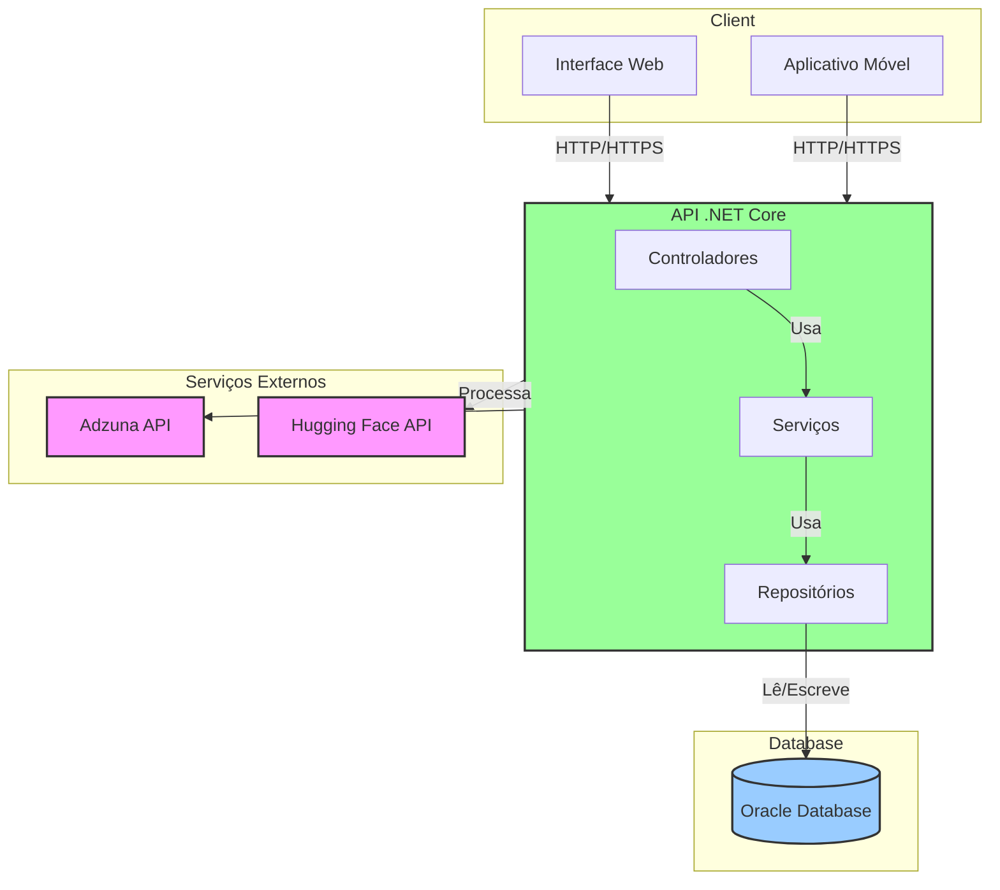

# Users API Buscadora de Vagas - .NET 8

API RESTful para busca de vagas de emprego usando Adzuna API, com gerenciamento de usuários e análise de currículo. Desenvolvida em .NET 8 com Oracle Database, seguindo as melhores práticas de desenvolvimento e arquitetura de software e padrões RESTful.

## 📋 Índice

- [Características](#características)
- [Tecnologias](#tecnologias)
- [Arquitetura](#arquitetura)
- [Pré-requisitos](#pré-requisitos)
- [Configuração](#configuração)
- [Executando o Projeto](#executando-o-projeto)
- [Versionamento da API](#versionamento-da-api)
- [Endpoints](#endpoints)
- [Health Checks](#health-checks)
- [Logging e Observabilidade](#logging-e-observabilidade)
- [HATEOAS](#hateoas)
- [CRUD - Exemplo em JSON](#crud---exemplo-em-json)
- [Variáveis de Ambiente](#variáveis-de-ambiente)
- [Scripts e Infraestrutura](#scripts-e-infraestrutura)
- [Arquitetura Macro (Mermaid JS)](#arquitetura-macro-mermaid-js)

## 🚀 Características

### 1. Boas Práticas REST
- ✅ **Paginação**: Suporte completo para paginação de resultados
- ✅ **HATEOAS**: Hypermedia As The Engine Of Application State
- ✅ **Status Codes**: Uso adequado de códigos HTTP (200, 201, 204, 400, 404, 409)
- ✅ **Verbos HTTP**: GET, POST, PUT, DELETE corretamente implementados
- ✅ **Validação de Dados**: Data Annotations e validações personalizadas

### 2. Monitoramento e Observabilidade
- ✅ **Health Checks**: Endpoints de verificação de saúde da aplicação
- ✅ **Logging**: Serilog com logs estruturados em Console e Arquivo
- ✅ **Tracing**: OpenTelemetry para rastreamento distribuído

### 3. Versionamento da API
- ✅ **Múltiplas Versões**: Suporte para `/api/v1` e `/api/v2`
- ✅ **Versionamento por URL**: Rotas versionadas
- ✅ **Versionamento por Header**: Suporte via `X-API-Version`
- ✅ **Versionamento por Query String**: Suporte via `?api-version=1.0`

### 4. Integração e Persistência
- ✅ **Oracle Database**: Integração completa com Oracle
- ✅ **Entity Framework Core**: ORM moderno e eficiente
- ✅ **Repository Pattern**: Separação de responsabilidades
- ✅ **BCrypt**: Hash seguro de senhas
- ✅ **Adzuna API**: Busca de vagas de emprego em tempo real
- ✅ **Variáveis de Ambiente**: Suporte a arquivo .env para credenciais

### 5. Frontend
- ✅ **Interface Web**: HTML/CSS/JavaScript responsivo
- ✅ **Upload de Currículo**: Extração de habilidades via Hugging Face
- ✅ **Sugestão Automática**: Localização e palavras-chave preenchidas pelo currículo
- ✅ **Busca de Vagas**: Disparo automático após upload (editável pelo usuário)
- ✅ **Listagem de Resultados**: Cards informativos com link para vaga

## 🛠️ Tecnologias

- **.NET 8**: Framework principal
- **ASP.NET Core**: Web API
- **Oracle Database**: Banco de dados relacional
- **Entity Framework Core**: ORM
- **Serilog**: Logging estruturado
- **OpenTelemetry**: Observabilidade e tracing
- **Swagger/OpenAPI**: Documentação interativa
- **Asp.Versioning**: Versionamento de API
- **Adzuna API**: API externa para busca de vagas
- **DotNetEnv**: Gerenciamento de variáveis de ambiente
- **HTML/CSS/JavaScript**: Frontend básico e responsivo

## 🏗️ Arquitetura

### Estrutura do Projeto

```
dotnet-gs2-2025/
├── Controllers/                   # Controladores da API
│   ├── V1/                       # API Versão 1
│   │   ├── JobsController.cs     # Busca de vagas
│   │   ├── ResumesController.cs  # Processamento de currículo
│   │   └── UsersController.cs    # Gerenciamento de usuários
│   ├── V2/                       # API Versão 2
│   │   └── UsersController.cs    # Versão aprimorada de usuários
│   └── HealthController.cs       # Health checks e monitoramento
│
├── Configuration/                 # Configurações da aplicação
│   └── HuggingFaceOptions.cs     # Configurações do modelo IA
│
├── Data/                         # Camada de dados
│   ├── ApplicationDbContext.cs   # Contexto do EF Core
│   └── Migrations/               # Migrações do banco de dados
│
├── Models/                       # Modelos de domínio
│   ├── HuggingFaceEntity.cs      # Entidades da API de IA
│   ├── User.cs                   # Entidade de usuário
│   └── DTOs/                     # Objetos de Transferência de Dados
│       ├── Requests/             # DTOs de requisição
│       │   ├── UserCreateDto.cs
│       │   ├── UserUpdateDto.cs
│       │   └── ResumeUploadRequestDto.cs
│       ├── Responses/            # DTOs de resposta
│       │   ├── JobDto.cs
│       │   ├── UserResponseDto.cs
│       │   ├── PagedResponse.cs
│       │   └── SkillExtractionResponseDto.cs
│       └── Shared/               # DTOs compartilhados
│           ├── Link.cs           # Para HATEOAS
│           └── ErrorResponse.cs  # Padrão de erros
│
├── Repositories/                 # Camada de acesso a dados
│   ├── IUserRepository.cs        # Interface do repositório
│   └── UserRepository.cs         # Implementação concreta
│
├── Services/                     # Lógica de negócios
│   ├── Interfaces/               # Contratos de serviço
│   │   ├── IUserService.cs
│   │   ├── IJobService.cs
│   │   └── IResumeService.cs
│   ├── External/                 # Integrações externas
│   │   ├── AdzunaService.cs
│   │   └── HuggingFaceService.cs
│   └── Implementations/          # Implementações dos serviços
│       └── UserService.cs
│
└── frontend/                     # Interface do usuário
    ├── index.html
    ├── css/
    └── js/
```

### Diagrama de Arquitetura



### Padrões de Design

- **Clean Architecture**: Separação clara de responsabilidades
- **Repository Pattern**: Abstração do acesso a dados
- **Dependency Injection**: Injeção de dependências para baixo acoplamento
- **DTO Pattern**: Transferência de dados entre camadas
- **HATEOAS**: Hypermedia como mecanismo de navegação

### Boas Práticas de API REST

1. **Verbos HTTP**
   - `GET`: Recuperar recursos
   - `POST`: Criar novos recursos
   - `PUT`: Atualizar recursos existentes (substituição completa)
   - `PATCH`: Atualização parcial de recursos
   - `DELETE`: Remover recursos

2. **Códigos de Status HTTP**
   - `200 OK`: Requisição bem-sucedida
   - `201 Created`: Recurso criado com sucesso
   - `204 No Content`: Sucesso sem conteúdo de retorno
   - `400 Bad Request`: Requisição inválida
   - `401 Unauthorized`: Não autenticado
   - `403 Forbidden`: Autenticado mas não autorizado
   - `404 Not Found`: Recurso não encontrado
   - `409 Conflict`: Conflito (ex: email já cadastrado)
   - `429 Too Many Requests`: Muitas requisições
   - `500 Internal Server Error`: Erro inesperado

3. **Versionamento**
   - Suporte a múltiplas versões da API
   - Versionamento por URL (`/api/v1/...`)
   - Versionamento por header (`X-API-Version: 1.0`)
   - Versionamento por query string (`?api-version=1.0`)

4. **Respostas Padronizadas**
   ```json
   // Sucesso (200 OK)
   {
     "data": { ... },
     "links": [
       { "rel": "self", "href": "/api/v1/users/1", "method": "GET" },
       { "rel": "update", "href": "/api/v1/users/1", "method": "PUT" }
     ]
   }

   // Erro (400 Bad Request)
   {
     "type": "https://tools.ietf.org/html/rfc7231#section-6.5.1",
     "title": "Bad Request",
     "status": 400,
     "traceId": "00-0e5c8a5f2f3e1b2a4c6d7e8f9a0b1c2d-1a2b3c4d5e6f7a8b-00",
     "errors": {
       "email": ["O campo Email é obrigatório"],
       "password": ["A senha deve ter no mínimo 8 caracteres"]
     }
   }
   ```

5. **Paginação**
   - Parâmetros: `page`, `pageSize`
   - Exemplo: `/api/v1/users?page=1&pageSize=10`
   - Resposta inclui metadados de paginação

6. **Filtros e Ordenação**
   - Filtros via query string
   - Ordenação via parâmetro `sort`
   - Exemplo: `/api/v1/jobs?location=sp&minSalary=5000&sort=-createdAt`
│   └── ResumeExtraction.cs        # Entidades consolidadas do currículo
├── Repositories/
│   ├── IUserRepository.cs         # Interface do repositório
│   └── UserRepository.cs          # Implementação do repositório
├── Services/
│   ├── IAdzunaService.cs          # Interface de vagas
│   ├── IHuggingFaceService.cs     # Interface IA de habilidades
│   ├── IResumeService.cs          # Interface processamento currículo
│   ├── IUserService.cs            # Interface do serviço
│   ├── AdzunaService.cs           # Integração com Adzuna
│   ├── HuggingFaceService.cs      # Integração com Hugging Face
│   ├── PdfTextExtractor.cs        # Leitura de texto em PDFs
│   ├── ResumeService.cs           # Orquestra extração de habilidades
│   └── UserService.cs             # Lógica de usuários
├── logs/                          # Logs da aplicação
├── appsettings.json               # Configurações
└── Program.cs                     # Configuração da aplicação
```

## 📦 Pré-requisitos

- **.NET 8 SDK**: [Download](https://dotnet.microsoft.com/download/dotnet/8.0)
- **Oracle Database**: Versão 11g ou superior
- **Oracle Client**: Oracle Data Provider for .NET

## ⚙️ Configuração

### 1. Clone o repositório

```bash
git clone <url-do-repositorio>
cd dotnet-gs2-2025
```

### 2. Configure as variáveis de ambiente

Crie um arquivo `.env` na raiz do projeto com suas credenciais:

```env
# Adzuna API Credentials
ADZUNA_APP_ID=seu_app_id_aqui
ADZUNA_APP_KEY=seu_app_key_aqui

# Hugging Face
HUGGINGFACE__TOKEN=seu_token_hugging_face

# Oracle Database Credentials
ORACLE_USER_ID=seu_usuario
ORACLE_PASSWORD=sua_senha
ORACLE_DATA_SOURCE=(DESCRIPTION=(ADDRESS=(PROTOCOL=TCP)(HOST=host)(PORT=1521))(CONNECT_DATA=(SERVICE_NAME=orcl)))
```

**Obtenha suas credenciais Adzuna em**: https://developer.adzuna.com/
**Token da API Hugging Face**: https://huggingface.co/settings/tokens

### 3. Certifique-se que a tabela existe no banco

A tabela `users` deve existir no banco de dados Oracle:

```sql
CREATE TABLE users (
    id NUMBER GENERATED ALWAYS AS IDENTITY PRIMARY KEY,
    name VARCHAR2(100) NOT NULL,
    email VARCHAR2(150) UNIQUE NOT NULL,
    password VARCHAR2(255) NOT NULL,
    phone VARCHAR2(20),
    created_at TIMESTAMP DEFAULT CURRENT_TIMESTAMP,
    updated_at TIMESTAMP DEFAULT CURRENT_TIMESTAMP
);
```

### 4. Restaure os pacotes

```bash
dotnet restore
```

## Executando o Projeto

### Modo Desenvolvimento

```bash
dotnet run
```

A aplicação estará disponível em:
- **HTTP**: http://localhost:5000
- **Swagger UI**: http://localhost:5000 (raiz)

### 5. Abra o Frontend

Abra o arquivo `frontend/index.html` no seu navegador ou use um servidor web local:

```bash
# Se tiver Python instalado
cd frontend
python -m http.server 8080
```

Depois acesse: `http://localhost:8080`

### Build para Produção

```bash
dotnet build -c Release
dotnet publish -c Release -o ./publish
```

## 🔄 Versionamento da API

A API suporta múltiplas formas de versionamento:

### 1. Via URL (Recomendado)
```
GET /api/v1/users
GET /api/v2/users
```

### 2. Via Header
```
GET /api/users
X-API-Version: 1.0
```

### 3. Via Query String
```
GET /api/users?api-version=1.0
GET /api/users?api-version=2.0
```

## 📍 Endpoints

### Versão 1 (v1)

#### GET /api/v1/users
Retorna lista paginada de usuários.

**Query Parameters:**
- `page` (int, default: 1): Número da página
- `pageSize` (int, default: 10, max: 100): Tamanho da página

**Resposta (200 OK):**
```json
{
  "page": 1,
  "pageSize": 10,
  "totalItems": 100,
  "totalPages": 10,
  "data": [
    {
      "id": 1,
      "name": "João Silva",
      "email": "joao@email.com",
      "phone": "(11) 98765-4321",
      "createdAt": "2024-01-01T10:00:00Z",
      "updatedAt": "2024-01-01T10:00:00Z",
      "links": [
        {
          "href": "http://localhost:5000/api/v1/users/1",
          "rel": "self",
          "method": "GET"
        },
        {
          "href": "http://localhost:5000/api/v1/users/1",
          "rel": "update",
          "method": "PUT"
        },
        {
          "href": "http://localhost:5000/api/v1/users/1",
          "rel": "delete",
          "method": "DELETE"
        }
      ]
    }
  ],
  "links": [
    {
      "href": "http://localhost:5000/api/v1/users?page=1&pageSize=10",
      "rel": "self",
      "method": "GET"
    },
    {
      "href": "http://localhost:5000/api/v1/users?page=2&pageSize=10",
      "rel": "next",
      "method": "GET"
    }
  ]
}
```

#### GET /api/v1/users/{id}
Retorna um usuário específico.

**Respostas:**
- `200 OK`: Usuário encontrado
- `404 Not Found`: Usuário não existe

#### POST /api/v1/users
Cria um novo usuário.

**Body:**
```json
{
  "name": "João Silva",
  "email": "joao@email.com",
  "password": "senha123",
  "phone": "(11) 98765-4321"
}
```

**Respostas:**
- `201 Created`: Usuário criado com sucesso
- `400 Bad Request`: Dados inválidos
- `409 Conflict`: Email já cadastrado

#### PUT /api/v1/users/{id}
Atualiza um usuário existente.

**Body (todos os campos são opcionais):**
```json
{
  "name": "João Silva Atualizado",
  "email": "joao.novo@email.com",
  "password": "novaSenha123",
  "phone": "(11) 98765-4321"
}
```

**Respostas:**
- `200 OK`: Usuário atualizado
- `400 Bad Request`: Dados inválidos
- `404 Not Found`: Usuário não existe
- `409 Conflict`: Email já cadastrado

#### DELETE /api/v1/users/{id}
Remove um usuário.

**Respostas:**
- `204 No Content`: Usuário removido
- `404 Not Found`: Usuário não existe

#### POST /api/v1/resumes/skills
Extrai habilidades de um currículo em PDF usando a IA Hugging Face.

**Form-Data:**
- `file` (arquivo, obrigatório): Currículo em formato PDF (máx. 5MB)

**Resposta (200 OK):**
```json
{
  "skills": ["Java", "Spring", "SQL"],
  "totalSkills": 3,
  "textLength": 12345,
  "locations": ["São Paulo", "Brasil"],
  "suggestedLocation": "São Paulo",
  "metadata": {
    "fileName": "curriculo.pdf",
    "fileSizeBytes": 345678
  },
  "links": [
    {
      "href": "http://localhost:5000/api/v1/resumes/skills",
      "rel": "self",
      "method": "POST"
    },
    {
      "href": "http://localhost:5000/api/v1/jobs/search",
      "rel": "jobs-search",
      "method": "POST"
    }
  ]
}
```

### Versão 2 (v2)

A versão 2 possui os mesmos endpoints com melhorias:
- **Page Size padrão**: 20 (ao invés de 10)
- **Headers adicionais**: `X-API-Version`, `X-Total-Count`, `X-Total-Pages`
- **Respostas de erro melhoradas**: Incluem `version` e `timestamp`

## 🏥 Health Checks

A API possui três endpoints de health check:

### 1. Health Check Completo
```
GET /health
```

Verifica todos os componentes incluindo banco de dados.

**Resposta (200 OK):**
```json
{
  "status": "Healthy",
  "totalDuration": "00:00:00.1234567",
  "entries": {
    "oracle-database": {
      "status": "Healthy",
      "duration": "00:00:00.1234567",
      "tags": ["db", "oracle", "database"]
    }
  }
}
```

### 2. Readiness Check
```
GET /health/ready
```

Verifica se a aplicação está pronta para receber tráfego.

### 3. Liveness Check
```
GET /health/live
```

Verifica se a aplicação está viva.

## 📊 Logging e Observabilidade

### Logging (Serilog)

Os logs são gravados em:
- **Console**: Logs formatados para desenvolvimento
- **Arquivo**: `logs/api-{Date}.log` (rotação diária)

**Níveis de Log:**
- Information: Eventos normais da aplicação
- Warning: Situações anormais mas recuperáveis
- Error: Erros que precisam atenção
- Fatal: Erros críticos que param a aplicação

### Tracing (OpenTelemetry)

A aplicação possui instrumentação para:
- **ASP.NET Core**: Requisições HTTP
- **HTTP Client**: Chamadas externas
- **Console Exporter**: Traces exibidos no console

## 🔗 HATEOAS

Todos os endpoints retornam links HATEOAS para navegação pela API.

**Tipos de Links:**
- `self`: Link para o próprio recurso
- `update`: Link para atualizar o recurso
- `delete`: Link para deletar o recurso
- `all-users`: Link para listar todos os usuários
- `next`: Próxima página (paginação)
- `previous`: Página anterior (paginação)
- `first`: Primeira página (paginação)
- `last`: Última página (paginação)

## 🔒 Segurança

✅ **Hash de Senhas com BCrypt**
- Implementado BCrypt para hash seguro de senhas
- Work factor configurado em 12 (bom equilíbrio entre segurança e performance)
- Salt automático único para cada senha
- Padrão da indústria para armazenamento seguro de senhas


