# Users API Buscadora de Vagas - .NET 8

API RESTful para busca de vagas de emprego usando Adzuna API, com gerenciamento de usuários e análise de currículo. Desenvolvida em .NET 8 com Oracle Database, seguindo as melhores práticas de desenvolvimento e arquitetura de software.

## 📋 Índice

- [Características](#características)
- [Tecnologias](#tecnologias)
- [Arquitetura](#arquitetura)
- [Pré-requisitos](#pré-requisitos)
- [Configuração](#configuração)
- [Executando o Projeto](#executando-o-projeto)
- [Versionamento da API](#versionamento-da-api)
- [Endpoints](#endpoints)
- [Health Checks](#health-checks)
- [Logging e Observabilidade](#logging-e-observabilidade)
- [HATEOAS](#hateoas)
- [CRUD - Exemplo em JSON](#crud---exemplo-em-json)
- [Variáveis de Ambiente](#variáveis-de-ambiente)
- [Scripts e Infraestrutura](#scripts-e-infraestrutura)
- [Arquitetura Macro (Mermaid JS)](#arquitetura-macro-mermaid-js)

## 🚀 Características

### 1. Boas Práticas REST
- ✅ **Paginação**: Suporte completo para paginação de resultados
- ✅ **HATEOAS**: Hypermedia As The Engine Of Application State
- ✅ **Status Codes**: Uso adequado de códigos HTTP (200, 201, 204, 400, 404, 409)
- ✅ **Verbos HTTP**: GET, POST, PUT, DELETE corretamente implementados
- ✅ **Validação de Dados**: Data Annotations e validações personalizadas

### 2. Monitoramento e Observabilidade
- ✅ **Health Checks**: Endpoints de verificação de saúde da aplicação
- ✅ **Logging**: Serilog com logs estruturados em Console e Arquivo
- ✅ **Tracing**: OpenTelemetry para rastreamento distribuído

### 3. Versionamento da API
- ✅ **Múltiplas Versões**: Suporte para `/api/v1` e `/api/v2`
- ✅ **Versionamento por URL**: Rotas versionadas
- ✅ **Versionamento por Header**: Suporte via `X-API-Version`
- ✅ **Versionamento por Query String**: Suporte via `?api-version=1.0`

### 4. Integração e Persistência
- ✅ **Oracle Database**: Integração completa com Oracle
- ✅ **Entity Framework Core**: ORM moderno e eficiente
- ✅ **Repository Pattern**: Separação de responsabilidades
- ✅ **BCrypt**: Hash seguro de senhas
- ✅ **Adzuna API**: Busca de vagas de emprego em tempo real
- ✅ **Variáveis de Ambiente**: Suporte a arquivo .env para credenciais

### 5. Frontend
- ✅ **Interface Web**: HTML/CSS/JavaScript responsivo
- ✅ **Upload de Currículo**: Extração de habilidades via Hugging Face
- ✅ **Sugestão Automática**: Localização e palavras-chave preenchidas pelo currículo
- ✅ **Busca de Vagas**: Disparo automático após upload (editável pelo usuário)
- ✅ **Listagem de Resultados**: Cards informativos com link para vaga

## 🛠️ Tecnologias

- **.NET 8**: Framework principal
- **ASP.NET Core**: Web API
- **Oracle Database**: Banco de dados relacional
- **Entity Framework Core**: ORM
- **Serilog**: Logging estruturado
- **OpenTelemetry**: Observabilidade e tracing
- **Swagger/OpenAPI**: Documentação interativa
- **Asp.Versioning**: Versionamento de API
- **Adzuna API**: API externa para busca de vagas
- **DotNetEnv**: Gerenciamento de variáveis de ambiente
- **HTML/CSS/JavaScript**: Frontend básico e responsivo

## 🏗️ Arquitetura

```
dotnet-gs2-2025/
├── Controllers/
│   ├── V1/
│   │   ├── JobsController.cs     # Busca de vagas
│   │   ├── ResumesController.cs  # Processamento de currículo
│   │   └── UsersController.cs    # API versão 1
│   ├── V2/
│   │   └── UsersController.cs    # API versão 2
│   └── HealthController.cs        # Health check
├── Configuration/
│   └── HuggingFaceOptions.cs     # Configurações do modelo IA
├── Data/
│   └── ApplicationDbContext.cs    # Contexto do EF Core
├── Models/
│   ├── HuggingFaceEntity.cs       # Entidades retornadas pela IA
│   ├── User.cs                    # Entidade User
│   └── DTOs/
│       ├── JobDto.cs              # DTO de vagas
│       ├── UserCreateDto.cs       # DTO para criação
│       ├── UserUpdateDto.cs       # DTO para atualização
│       ├── UserResponseDto.cs     # DTO para resposta
│       ├── PagedResponse.cs       # DTO para paginação
│       ├── ResumeUploadRequestDto.cs # DTO upload de currículo
│       ├── SkillExtractionResponseDto.cs # DTO resposta Hugging Face
│       ├── SkillExtractionResult.cs # Resultado interno de extração
│       └── Link.cs                # DTO para HATEOAS
│   └── ResumeExtraction.cs        # Entidades consolidadas do currículo
├── Repositories/
│   ├── IUserRepository.cs         # Interface do repositório
│   └── UserRepository.cs          # Implementação do repositório
├── Services/
│   ├── IAdzunaService.cs          # Interface de vagas
│   ├── IHuggingFaceService.cs     # Interface IA de habilidades
│   ├── IResumeService.cs          # Interface processamento currículo
│   ├── IUserService.cs            # Interface do serviço
│   ├── AdzunaService.cs           # Integração com Adzuna
│   ├── HuggingFaceService.cs      # Integração com Hugging Face
│   ├── PdfTextExtractor.cs        # Leitura de texto em PDFs
│   ├── ResumeService.cs           # Orquestra extração de habilidades
│   └── UserService.cs             # Lógica de usuários
├── logs/                          # Logs da aplicação
├── appsettings.json               # Configurações
└── Program.cs                     # Configuração da aplicação
```

## 📦 Pré-requisitos

- **.NET 8 SDK**: [Download](https://dotnet.microsoft.com/download/dotnet/8.0)
- **Oracle Database**: Versão 11g ou superior
- **Oracle Client**: Oracle Data Provider for .NET

## ⚙️ Configuração

### 1. Clone o repositório

```bash
git clone <url-do-repositorio>
cd dotnet-gs2-2025
```

### 2. Configure as variáveis de ambiente

Crie um arquivo `.env` na raiz do projeto com suas credenciais:

```env
# Adzuna API Credentials
ADZUNA_APP_ID=seu_app_id_aqui
ADZUNA_APP_KEY=seu_app_key_aqui

# Hugging Face
HUGGINGFACE__TOKEN=seu_token_hugging_face

# Oracle Database Credentials
ORACLE_USER_ID=seu_usuario
ORACLE_PASSWORD=sua_senha
ORACLE_DATA_SOURCE=(DESCRIPTION=(ADDRESS=(PROTOCOL=TCP)(HOST=host)(PORT=1521))(CONNECT_DATA=(SERVICE_NAME=orcl)))
```

**Obtenha suas credenciais Adzuna em**: https://developer.adzuna.com/
**Token da API Hugging Face**: https://huggingface.co/settings/tokens

### 3. Certifique-se que a tabela existe no banco

A tabela `users` deve existir no banco de dados Oracle:

```sql
CREATE TABLE users (
    id NUMBER GENERATED ALWAYS AS IDENTITY PRIMARY KEY,
    name VARCHAR2(100) NOT NULL,
    email VARCHAR2(150) UNIQUE NOT NULL,
    password VARCHAR2(255) NOT NULL,
    phone VARCHAR2(20),
    created_at TIMESTAMP DEFAULT CURRENT_TIMESTAMP,
    updated_at TIMESTAMP DEFAULT CURRENT_TIMESTAMP
);
```

### 4. Restaure os pacotes

```bash
dotnet restore
```

## Executando o Projeto

### Modo Desenvolvimento

```bash
dotnet run
```

A aplicação estará disponível em:
- **HTTP**: http://localhost:5000
- **HTTPS**: https://localhost:5001
- **Swagger UI**: http://localhost:5000 (raiz)

### 5. Abra o Frontend

Abra o arquivo `frontend/index.html` no seu navegador ou use um servidor web local:

```bash
# Se tiver Python instalado
cd frontend
python -m http.server 8080
```

Depois acesse: `http://localhost:8080`

### Build para Produção

```bash
dotnet build -c Release
dotnet publish -c Release -o ./publish
```

## 🔄 Versionamento da API

A API suporta múltiplas formas de versionamento:

### 1. Via URL (Recomendado)
```
GET /api/v1/users
GET /api/v2/users
```

### 2. Via Header
```
GET /api/users
X-API-Version: 1.0
```

### 3. Via Query String
```
GET /api/users?api-version=1.0
GET /api/users?api-version=2.0
```

## 📍 Endpoints

### Versão 1 (v1)

#### GET /api/v1/users
Retorna lista paginada de usuários.

**Query Parameters:**
- `page` (int, default: 1): Número da página
- `pageSize` (int, default: 10, max: 100): Tamanho da página

**Resposta (200 OK):**
```json
{
  "page": 1,
  "pageSize": 10,
  "totalItems": 100,
  "totalPages": 10,
  "data": [
    {
      "id": 1,
      "name": "João Silva",
      "email": "joao@email.com",
      "phone": "(11) 98765-4321",
      "createdAt": "2024-01-01T10:00:00Z",
      "updatedAt": "2024-01-01T10:00:00Z",
      "links": [
        {
          "href": "http://localhost:5000/api/v1/users/1",
          "rel": "self",
          "method": "GET"
        },
        {
          "href": "http://localhost:5000/api/v1/users/1",
          "rel": "update",
          "method": "PUT"
        },
        {
          "href": "http://localhost:5000/api/v1/users/1",
          "rel": "delete",
          "method": "DELETE"
        }
      ]
    }
  ],
  "links": [
    {
      "href": "http://localhost:5000/api/v1/users?page=1&pageSize=10",
      "rel": "self",
      "method": "GET"
    },
    {
      "href": "http://localhost:5000/api/v1/users?page=2&pageSize=10",
      "rel": "next",
      "method": "GET"
    }
  ]
}
```

#### GET /api/v1/users/{id}
Retorna um usuário específico.

**Respostas:**
- `200 OK`: Usuário encontrado
- `404 Not Found`: Usuário não existe

#### POST /api/v1/users
Cria um novo usuário.

**Body:**
```json
{
  "name": "João Silva",
  "email": "joao@email.com",
  "password": "senha123",
  "phone": "(11) 98765-4321"
}
```

**Respostas:**
- `201 Created`: Usuário criado com sucesso
- `400 Bad Request`: Dados inválidos
- `409 Conflict`: Email já cadastrado

#### PUT /api/v1/users/{id}
Atualiza um usuário existente.

**Body (todos os campos são opcionais):**
```json
{
  "name": "João Silva Atualizado",
  "email": "joao.novo@email.com",
  "password": "novaSenha123",
  "phone": "(11) 98765-4321"
}
```

**Respostas:**
- `200 OK`: Usuário atualizado
- `400 Bad Request`: Dados inválidos
- `404 Not Found`: Usuário não existe
- `409 Conflict`: Email já cadastrado

#### DELETE /api/v1/users/{id}
Remove um usuário.

**Respostas:**
- `204 No Content`: Usuário removido
- `404 Not Found`: Usuário não existe

#### POST /api/v1/resumes/skills
Extrai habilidades de um currículo em PDF usando a IA Hugging Face.

**Form-Data:**
- `file` (arquivo, obrigatório): Currículo em formato PDF (máx. 5MB)

**Resposta (200 OK):**
```json
{
  "skills": ["Java", "Spring", "SQL"],
  "totalSkills": 3,
  "textLength": 12345,
  "locations": ["São Paulo", "Brasil"],
  "suggestedLocation": "São Paulo",
  "metadata": {
    "fileName": "curriculo.pdf",
    "fileSizeBytes": 345678
  },
  "links": [
    {
      "href": "http://localhost:5000/api/v1/resumes/skills",
      "rel": "self",
      "method": "POST"
    },
    {
      "href": "http://localhost:5000/api/v1/jobs/search",
      "rel": "jobs-search",
      "method": "POST"
    }
  ]
}
```

### Versão 2 (v2)

A versão 2 possui os mesmos endpoints com melhorias:
- **Page Size padrão**: 20 (ao invés de 10)
- **Headers adicionais**: `X-API-Version`, `X-Total-Count`, `X-Total-Pages`
- **Respostas de erro melhoradas**: Incluem `version` e `timestamp`

## 🏥 Health Checks

A API possui três endpoints de health check:

### 1. Health Check Completo
```
GET /health
```

Verifica todos os componentes incluindo banco de dados.

**Resposta (200 OK):**
```json
{
  "status": "Healthy",
  "totalDuration": "00:00:00.1234567",
  "entries": {
    "oracle-database": {
      "status": "Healthy",
      "duration": "00:00:00.1234567",
      "tags": ["db", "oracle", "database"]
    }
  }
}
```

### 2. Readiness Check
```
GET /health/ready
```

Verifica se a aplicação está pronta para receber tráfego.

### 3. Liveness Check
```
GET /health/live
```

Verifica se a aplicação está viva.

## 📊 Logging e Observabilidade

### Logging (Serilog)

Os logs são gravados em:
- **Console**: Logs formatados para desenvolvimento
- **Arquivo**: `logs/api-{Date}.log` (rotação diária)

**Níveis de Log:**
- Information: Eventos normais da aplicação
- Warning: Situações anormais mas recuperáveis
- Error: Erros que precisam atenção
- Fatal: Erros críticos que param a aplicação

### Tracing (OpenTelemetry)

A aplicação possui instrumentação para:
- **ASP.NET Core**: Requisições HTTP
- **HTTP Client**: Chamadas externas
- **Console Exporter**: Traces exibidos no console

## 🔗 HATEOAS

Todos os endpoints retornam links HATEOAS para navegação pela API.

**Tipos de Links:**
- `self`: Link para o próprio recurso
- `update`: Link para atualizar o recurso
- `delete`: Link para deletar o recurso
- `all-users`: Link para listar todos os usuários
- `next`: Próxima página (paginação)
- `previous`: Página anterior (paginação)
- `first`: Primeira página (paginação)
- `last`: Última página (paginação)

## 🗂️ CRUD - Exemplo em JSON

### Usuário (User)
```json
{
  "id": 1,
  "full_name": "Admin User",
  "email": "admin@example.com",
  "password_hash": "<hash>",
  "phone": "11999999999",
  "location": "São Paulo, SP",
  "date_of_birth": "1990-01-01",
  "bio": "Administrator",
  "profile_picture_url": "https://...",
  "is_active": true,
  "created_at": "2025-11-18T10:00:00Z"
}
```

### Currículo (Resume)
```json
{
  "id": 1,
  "user_id": 1,
  "file_url": "https://...",
  "full_text": "Texto extraído do PDF...",
  "skills": ["C#", ".NET", "Azure"],
  "experience": ["Desenvolvedor .NET", "Analista de Sistemas"],
  "education": ["FIAP", "USP"],
  "extracted_at": "2025-11-18T10:00:00Z"
}
```

### Vaga (Job)
```json
{
  "id": 1,
  "external_id": "adzuna-123",
  "title": "Desenvolvedor .NET",
  "company": "Empresa X",
  "description": "Atuar com .NET 8 e Azure...",
  "location": "São Paulo, SP",
  "job_type": "CLT",
  "salary_min": 7000.00,
  "salary_max": 12000.00,
  "currency": "BRL",
  "url": "https://adzuna.com/job/123",
  "source": "Adzuna",
  "created_at": "2025-11-18T10:00:00Z"
}
```

## 🛡️ Variáveis de Ambiente
- Todas as credenciais e dados sensíveis devem ser configurados via Variable Group no Azure DevOps.
- Nunca versionar secrets no repositório.
- Exemplo de variáveis:
  - DB_HOST, DB_PORT, DB_NAME, DB_USER, DB_PASSWORD
  - ASPNETCORE_ENVIRONMENT
  - Connection strings protegidas

## 📦 Scripts e Infraestrutura
- Scripts de provisionamento: `/scripts/script-infra.sh` e `/scripts/script-infra.cmd`
- Script de banco de dados: `/scripts/script-bd.sql`
- Dockerfile: `/Dockerfile`
- Pipeline: `/azure-pipelines.yml`

## 🗺️ Arquitetura Macro (Mermaid JS)

```mermaid
flowchart TD
    subgraph Azure
        ACR[Azure Container Registry]
        ACI[Azure Container Instance]
        MYSQL[Azure Database for MySQL]
        Storage[Azure Storage]
    end
    Dev[DevOps Pipeline]
    Dev -->|Build & Push| ACR
    ACR -->|Deploy| ACI
    ACI -->|Conecta| MYSQL
    ACI -->|Salva artefatos| Storage
    User[Usuário] -->|HTTP| ACI
```


## 📝 Exemplos de Uso

### cURL

```bash
# Listar usuários
curl -X GET "http://localhost:5000/api/v1/users?page=1&pageSize=10"

# Obter usuário específico
curl -X GET "http://localhost:5000/api/v1/users/1"

# Criar usuário
curl -X POST "http://localhost:5000/api/v1/users" \
  -H "Content-Type: application/json" \
  -d '{
    "name": "João Silva",
    "email": "joao@email.com",
    "password": "senha123",
    "phone": "(11) 98765-4321"
  }'

# Atualizar usuário
curl -X PUT "http://localhost:5000/api/v1/users/1" \
  -H "Content-Type: application/json" \
  -d '{
    "name": "João Silva Atualizado"
  }'

# Deletar usuário
curl -X DELETE "http://localhost:5000/api/v1/users/1"

# Health Check
curl -X GET "http://localhost:5000/health"
```

### PowerShell

```powershell
# Listar usuários
Invoke-RestMethod -Uri "http://localhost:5000/api/v1/users?page=1&pageSize=10" -Method Get

# Criar usuário
$body = @{
    name = "João Silva"
    email = "joao@email.com"
    password = "senha123"
    phone = "(11) 98765-4321"
} | ConvertTo-Json

Invoke-RestMethod -Uri "http://localhost:5000/api/v1/users" -Method Post -Body $body -ContentType "application/json"
```

## 🔒 Segurança

✅ **Hash de Senhas com BCrypt**
- Implementado BCrypt para hash seguro de senhas
- Work factor configurado em 12 (bom equilíbrio entre segurança e performance)
- Salt automático único para cada senha
- Padrão da indústria para armazenamento seguro de senhas

## 📄 Licença

Este projeto é de código aberto para fins educacionais.


